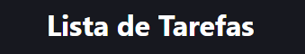
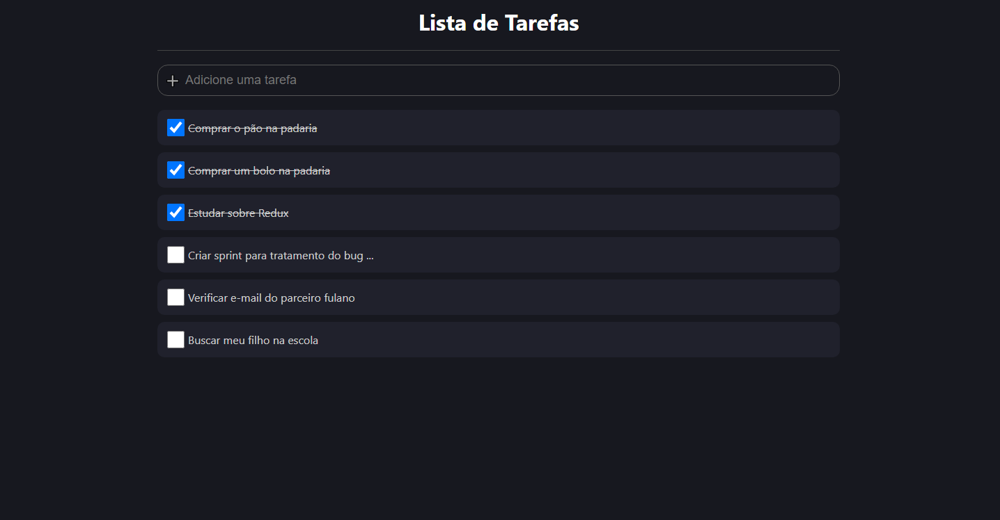
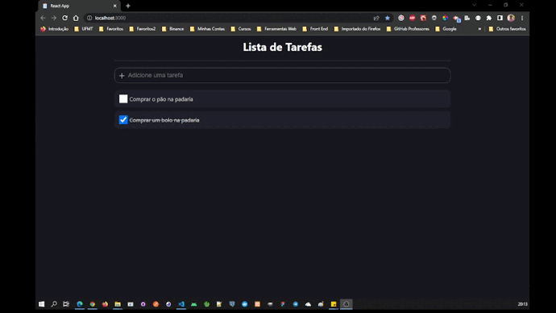
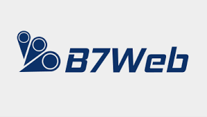
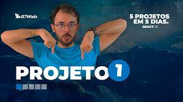

<h1 align="center">
  
</h1>

<div align="center">
  <a href="#-projeto">Projeto</a>&nbsp;&nbsp;&nbsp;|&nbsp;&nbsp;&nbsp;
  <a href="#-tecnologias">Tecnologias</a>&nbsp;&nbsp;&nbsp;|&nbsp;&nbsp;&nbsp;
  <a href="#-licença">Licença</a>&nbsp;&nbsp;&nbsp;|&nbsp;&nbsp;&nbsp;
  <a href="#-autor">Autor</a>
</div>

<br> 

<p align="center">
  
  
  
</p>

<br>

## 💻 Projeto

Neste sistema podemos adicionar nossas tarefas do dia-a-dia para um controle do que precisamos fazer e marcar o que já foi realizado.  
<br>
O objetivo no desenvolvimento deste projeto não é criar um layout responsivo, trata-se de uma aplicação simples, com o objetivo de praticar programação com ReactJS + Typescript na criação de types, props, componentes e hooks.
<br>

- [Visitar site do projeto](https://wanderson-a-timoteo-to-do-list-react-flax.vercel.app/)

### Tela do Sistema

<p align="center">
  
</p>
<br>

### Gif do Sistema Funcionando
<p align="center">
  
</p>
<br>

## 🚀 Tecnologias

Esse projeto foi desenvolvido com as seguintes tecnologias e ferramentas:

- [React](https://pt-br.reactjs.org/)
- [Typescript](https://www.typescriptlang.org/)
- [Styled-Components](https://styled-components.com/)

<br>

## 🔥 Executar Aplicação

### 🎇 Executando Localmente a Aplicação

Caso você deseja executar o projeto na sua máquina local, você precisará instalar o Node.js, após a instalação, basta seguir os passos abaixo:

### 🌀 Começando...

Para começar, você deve simplesmente clonar o repositório do projeto na sua máquina e instalar as dependências.

### ❗️ Instalando as Dependências (via Windows):

Abra o cmd (caso esteja utilizando o Windows) navegue até o local onde você clonou o projeto, exemplo:

```sh
C:\Users\NomeDoComputador\Documents\CloneDoProjeto
```

Quando encontrar a pasta do projeto, basta acessar a pasta `to-do-list-react`. Dentro desta pasta abra digite a seguinte instrução: **(dentro da pasta `to-do-list-react` do projeto clonado)**

```sh
npm install
```

Ao digitar a instrução acima, automaticamente ele irá baixar todas as dependências listadas e definidas no arquivo package.json:

- `node_modules` - que contêm os packages do npm que precisará para o projeto.

### 🛰️ Executando o projeto

Bom, agora que instalou as dependências **(dentro da pasta `to-do-list-react` do projeto clonado)** ainda no terminal cmd digite a instrução abaixo para executar o projeto:

```sh
npm start
```

Pronto! dessa forma o projeto `to-do-list-react` estará rodando localmente em sua maquina, acesse:

```sh
http://localhost:3000
```
<br>

## 🚩 Tenho Dúvidas... O que fazer?

Caso tenha dúvidas sobre o código do projeto, sintam-se a vontade em abrir uma **[ISSUE AQUI](https://github.com/Wanderson-A-Timoteo/to-do-list-react/issues)**. Assim que possível, responderei todas as dúvidas!

<br>

## 💡 Licença

Esse projeto está sob a licença MIT. Veja o arquivo [LICENSE](.github/LICENSE.md) para mais detalhes.

<br>

## 🎆 Autor

Feito com ♥ by

-  [**Wanderson A. Timóteo**](https://wanderson.tk)

<br>

## 🤝 Agradecimentos


<div align="center">
  

<h2 align="center">
  Desafio 5 Projetos em 5 Dias
</h2>
<p align="center">
  
</p>
<br>

- Projeto desenvolvido durante o `Desafio 5 Projetos em 5 Dias` com ReactJS, realizado pela plataforna de ensino [B7WEB](https://b7web.com.br/fullstack/?ref=K40921767Y&msclkid=19c576ee8ce315d5acd514754d2e3dc6).

- Agradecimento ao [Bonieky Lacerda](https://www.instagram.com/bonieky/) por compartilhar conteúdo relevante e com qualidade de ensino.
